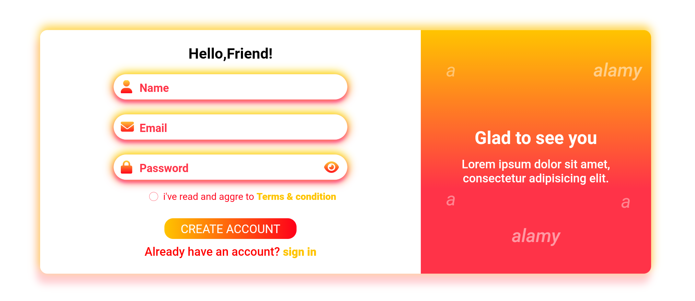

# Sign Up Form - UI/UX Design

## Project Overview
This project is a simple and visually appealing **Sign Up Form** designed with HTML and CSS. It was inspired by a modern UI/UX design concept that combines clean input fields, gradient backgrounds, and a responsive layout.

## Features
- **Responsive Design**: The form adjusts seamlessly to different screen sizes, providing an optimal user experience on both desktop and mobile devices.
- **Gradient Background**: A smooth gradient transitions between warm colors, enhancing the visual appeal.
- **Interactive Form Elements**: Styled input fields with focus states and an accessible, clearly labeled "Create Account" button.
- **Terms & Conditions Checkbox**: Includes an interactive checkbox to agree to terms and conditions.

## Technologies Used
- **HTML5**
- **CSS3**

## Screenshot

## How to Use
1. Clone or download the repository.
2. Open `index.html` in your browser to view the form.

## Future Improvements
- Implement form validation using JavaScript.
- Add a backend to handle form submissions.
- Improve accessibility by adding ARIA labels and improving color contrast for better visibility.

## License
This project is licensed under the MIT License.

